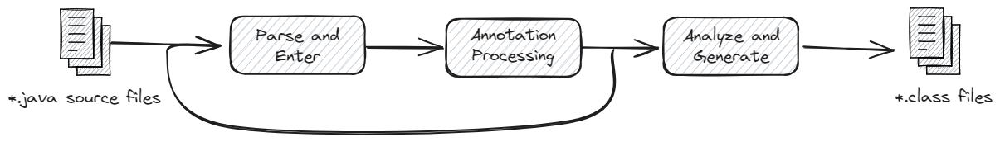
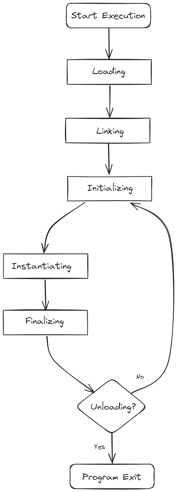

# Hello Java!

When learning any new programming language, it is traditional to start with the simplest program that displays the
message "_Hello, World!_".

## Dissecting the “Hello, World!” Program

To get started, let's create a new directory called `helloworld` in which to place the code. Next, create a file called
`HelloJava.java`. Add the following code to your file. It is the bare minimum code for printing a "Hello World!"
message to the console.

```java
package helloworld; //(1)

// Your first Java program. //(2)

public class HelloJava {    //(3)
    public static void main(String[] args) {    //(4)
        System.out.println("Hello, World!");    //(5)
    }
}
```

Java is an object-oriented language, not a scripting language that can be used to quickly dash off a few commands. It is
squarely intended as a language for larger programs that benefit from being organized into classes, packages, and
modules. Some languages have global variables and functions as well as variables and methods inside classes. In Java,
everything is declared inside a class. This uniformity can lead to somewhat boilerplate-driven, but it makes it easy to
understand the meaning of a program.

- (1) Declares the package to which the `HelloJava` class belongs. A _package_ is a named collection of classes,
  interfaces, and other reference types. Packages serve to group related classes and define a namespace for the classes
  they contain. Checkout 👉 [this](../Chapter%202/Packages-and-the-Java-Namespace.md) to deeply understand what is
  _packages_ in Java.
- (2) This line is a comment. All characters between `//` and the end of the line are ignored by the compiler and are
  meant for human readers only.
- (3) Defines a class named "HelloJava" by using `class` keyword. Additionally, the `public` keyword signifies that the
  class `HelloJava` is public, which mean it can be accessible from any other class in the program or even from classes
  in other packages. The body of the class (or method) is surrounded by curly brackets `{...}`
- (4) The `main` method is the first method called when the program runs. It's declared as `static` to indicate that the
  method doesn’t operate on any objects (To understand how magic the `static` keyword works, checkout [this]()). The
  method is declared as `void` to indicate that it doesn't return any value.
- (5) Finally, we come to the body of the `main` method. It consists of a single line with a command to print a message
  to `System.out`, an object representing the 'standard output' of the Java program.

## Compiling and Executing

To compile and execute the program you just wrote second ago, you need to have the Java Development Kit (JDK). Get it
from [here](https://www.oracle.com/java/technologies/downloads/).

### Compiling

As we discuss in "The Way Java Works," [Java in Definition](Java-in-Definition.md), A compiler is an application that
translates programs from the Java language into Java bytecode, which is more suitable for executing on the JVM. It takes
a file with the `.java` extension as input and produces a file with a `.class` extension. The Java Compiler is invoked
at terminal as follows:

````
> javac HelloWorld.java
````

The process of compiling a set of source files into a corresponding set of class files is not simple, but can be
generally divided into three stages. Different parts of source files may proceed through the process at different rates,
on an "as needed" basis.

<div align="center">
  
</div>

This process is handled by the `JavaCompiler` class:

- **Parse and Enter**: All the source files specified on the command line are read, parsed into syntax trees, and then
  all externally visible definitions are entered into the compiler's symbol tables.
- **Annotation Processing**: All appropriate annotation processors are called. If any annotation processors generate any
  new source or class files, the compilation is restarted, until no new files are created.
- **Analyze and Generate**: The syntax trees created by the parser are analyzed and translated into class files. During
  the analysis, references to additional classes may be found. The compiler will check the source and class path for
  these classes; if they're found on the source path, those files will be compiled as well, although they won't be
  subject to annotation processing.

### Executing

Once your program successfully compiles into Java bytecodes, you can interpret and run program on any JVM, since the
class files generated by the compiler are independent of the OS. The Java Interpreter is invoked at the terminal as
follows:

````
> java HelloJava
````

At the terminal, you should see the result `Hello, World!`.

The JVM is responsible for executes the bytecode and the program runs. This includes loading the bytecode, allocating
memory, and converting the bytecode into native machine code. In other words, JVM handles the task of translating the
bytecode into machine code that is specific to the target platform and executing program. The JVM also provides runtime
services such as memory management, thread synchronization, and exception handling. The following activity diagram
illustrates what happen during this phase:

<div align="center">
  
</div>

We will discuss more specific about these processes in this [article](). Currently, all you have to do is execute your
first program, and start writing some simple code to understand the fundamental of programming as well as Java syntax.


## References

- [Compilation Overview](https://openjdk.org/groups/compiler/doc/compilation-overview/index.html)
- [Java Language Specification 24th Edition](https://docs.oracle.com/javase/specs/jls/se24/jls24.pdf)