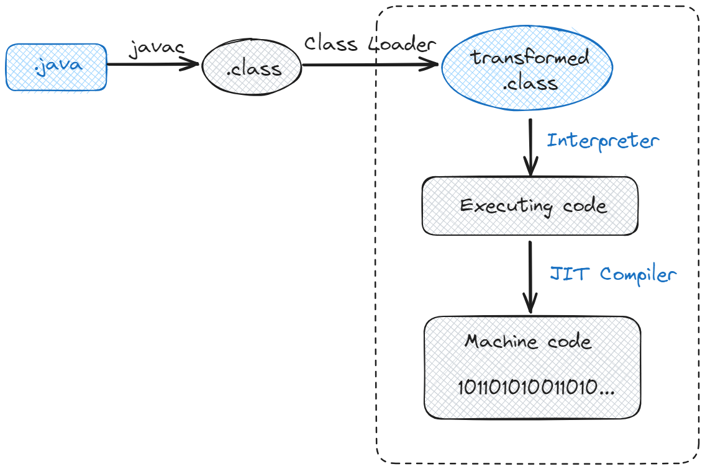

# Java in Definition

Java is a powerful, general-purpose programming environment. The term "Java" is often used by people habitually to refer
to its concepts, including programming language, execution environment, and ecosystem, with the precise usage inferred
from context.

## Do you understand right about Java?

The base Java programming environment has been introduced since the late 1990s by James Gosling, Mike Sheridan and
Patrick Naughton, a team of engineers at Sun Microsystems. It is composed of the Java language and the supporting
runtime, the Java Virtual Machine (JVM). The third one, the Java ecosystem beyond the standard libraries included with
Java, is supported by third parties, including open-source projects and Java technologies providers (Spring Framework,
Quarkus, etc.).

Java was originally composed of several different, but related, environments and specifications, such as Java Mobile
Edition (Java ME), Java Standard Edition (Java SE), and Java Enterprise Edition (Java EE). Generally speaking, if
someone says "Java" without any further clarification, they usually mean Java SE for sure.

## The Java Programming Language

In language context, Java is a high-level, robust, general-purpose, class-based, memory-safe, object-oriented
programming language. Java programs are written as source code in the Java language, which is a human-readable
language. The language syntax was intentionally designed to model that of C/C++, making it familiar to programmers
who were accustomed to these dominant languages at the time Java was created. Despite the similar source code to C++,
in practice, Java includes features and a managed runtime that has much more in common with dynamic languages such as
Smalltalk.

Java is considered to be relatively easy to read and write, or you can call it a boilerplate-driven language for
writing verbose code 📝. Java language has a rigid grammar and simple program structure, it is intended to provide a
stable and reliable foundation for companies to build business-critical applications, or make you more struggle when try
to scale your project.

In the last so years, Java tries to modernize its language syntax somewhat, to address concerns about verbosity and
provide features more similar to programmers coming from other popular languages. For example, Java 8 added some impact
features like Lambda expressions and Stream API. It gave developers a slightly less painful way to suffer 😭.

// TODO: migrate to Java History.
As we'll discuss later, the Java project has transitioned to a new release model. In this new model, Java versions are
released every 6 months, only certain versions (8, 11, 17, 21, and 25) are considered eligible for Long-term Support
(LTS). All other versions are supported for only 6 months and haven’t seen widespread adoption by development teams.

## What the hell is JVM, JRE, JDK?

### The Java Virtual Machine (JVM)

Java Virtual Machine is a virtualization engine that enables Java programs to run on various hardware platforms without
modification. The JVM has been ported to run on a large number of hardware environments, think of it as a _translator_
that understands the Java language and communicates it to your computer.

Here are various key features of the JVM:

- **Platform Independence**: The most famous Java slogan "Write Once, Run Anywhere (WORA)" starts from one of the JVM key
  features. Java code is compiled into bytecode, which is done by the _Java Compiler_ (javac)
- **Performance**: The JVM uses Just-in-Time (JIT) Compiler that converts bytecode into native machine code just before
  execution. This can significantly speed up the performance of Java programs.
- **Security**: The JVM provides a secure execution environment by using a variety of mechanisms like bytecode verification,
  runtime security checks, and _garbage collection_.
- **Multithreading and Synchronization**: Sound confusing, right? I'll explain it later in the next chapter the simplest
  way. Now all you have to know is the JVM supports multithreaded execution and built-in synchronization to facilitate
  concurrent programming.

## The Way Java Works

## References

- [Java in a Nutshell, 8th Edition](https://www.oreilly.com/library/view/java-in-a/9781098130992/)