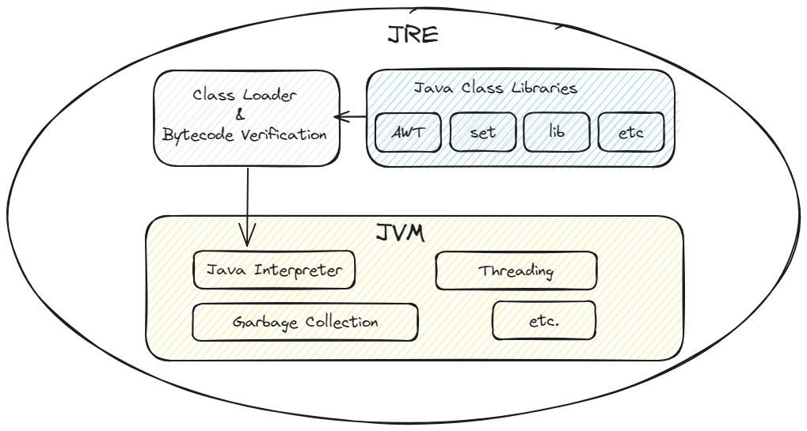
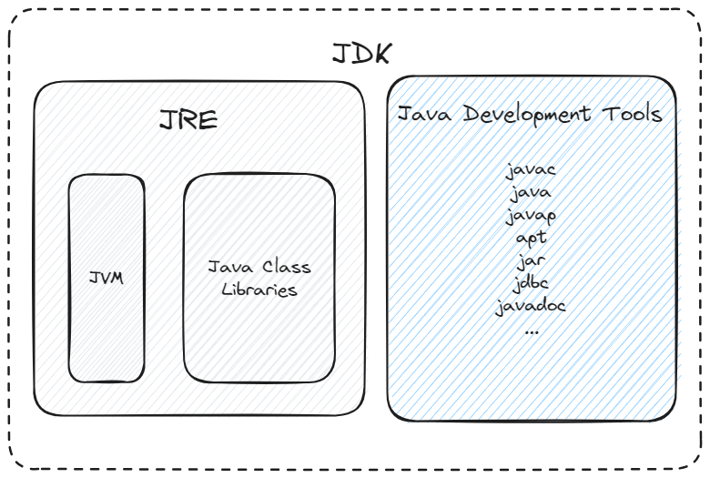

# Java in Definition

Java is a powerful, general-purpose programming environment. The term "Java" is often used by people
habitually to refer to its concepts, including programming language, execution environment, and ecosystem, with the
precise usage inferred from context.

<!-- TOC -->
* [Java in Definition](#java-in-definition)
  * [Do you understand right about Java?](#do-you-understand-right-about-java)
  * [The Java Programming Language](#the-java-programming-language)
  * [The Way Java Works](#the-way-java-works)
  * [What the hell is JVM, JRE, JDK?](#what-the-hell-is-jvm-jre-jdk)
    * [The Java Virtual Machine (JVM)](#the-java-virtual-machine-jvm)
    * [The Java Runtime Environment (JRE)](#the-java-runtime-environment-jre)
    * [The Java Development Kit (JDK)](#the-java-development-kit-jdk)
  * [References](#references)
<!-- TOC -->

## Do you understand right about Java?

The base Java programming environment has been introduced since the late 1990s by James Gosling, Mike Sheridan and
Patrick Naughton, a team of engineers at Sun Microsystems. It is composed of the Java language and the supporting
runtime, the Java Virtual Machine (JVM). The third one, the Java ecosystem beyond the standard libraries included with
Java, is supported by third parties, including open-source projects and Java technologies providers (Spring Framework,
Quarkus, etc.).

Java was originally composed of several different, but related, environments and specifications, such as Java Mobile
Edition (Java ME), Java Standard Edition (Java SE), and Java Enterprise Edition (Java EE). Generally speaking, if
someone says "Java" without any further clarification, they usually mean Java SE for sure.

## The Java Programming Language

In language context, Java is a high-level, robust, general-purpose, class-based, memory-safe, cross-platform,
object-oriented
programming language. Java programs are written as source code in the Java language, which is a human-readable
language. The language syntax was intentionally designed to model that of C/C++, making it familiar to programmers
who were accustomed to these dominant languages at the time Java was created. Despite the similar source code to C++,
in practice, Java includes features and a managed runtime that has much more in common with dynamic languages such as
Smalltalk.

Java is considered to be relatively easy to read and write, or you can call it a boilerplate-driven language for
writing verbose code 📝. Java language has a rigid grammar and simple program structure, it is intended to provide a
stable and reliable foundation for companies to build business-critical applications, or make you more struggle when try
to scale your project.

In the last so years, Java tries to modernize its language syntax somewhat, to address concerns about verbosity and
provide features more similar to programmers coming from other popular languages. For example, Java 8 added some impact
features like Lambda expressions and Stream API. It gave developers a slightly less painful way to suffer 😭.

// TODO: migrate to Java History.
As we'll discuss later, the Java project has transitioned to a new release model. In this new model, Java versions are
released every 6 months, only certain versions (8, 11, 17, 21, and 25) are considered eligible for Long-term Support
(LTS). All other versions are supported for only 6 months and haven’t seen widespread adoption by development teams.

## The Way Java Works

As we discussed earlier, Java is a cross-platform programming language, this means that it can be written for one OS and
run on another. Java was branded with the slogan "Write Once, Run Anywhere (WORA)"; this meant that a Java program could
be developed on any device. How is this possible? Let me explain in the following figure:

- _Phase 1_: **Write some Java code ✏️**. As a developer, we write code. And of course, we're using our favorite
  programming language, Java~~Script~~. You essentially tell the computer what to do in some source code file with
  extension `.java`. But since computers don't directly understand Java language, the source code needs to translate to
  some kind of language that computers speak.

  You can be a Pro by writing code without an Integrated Development Environment (IDE) 💪 or you can use
  those tools: [VSCode](https://code.visualstudio.com/), [IntelliJ IDEA](https://code.visualstudio.com/),
  [NetBeans](https://netbeans.apache.org/front/main/index.html), [Eclipse](https://www.eclipse.org/downloads/), etc.
  Make sure that your Java source does not have any errors.

- _Phase 2_: **Compile a Java program 🛠️**. Java Compiler (javac), a part of the Java Development Kit (JDK), is
  responsible for converting your human-readable Java code into a `.class` extension files which contain _Java
  Bytecode_. This is a form of code the JVM can understand. After that, all the `.class` file will be loaded into JVM
  memory.

  Java Bytecode is like a middle step between human-readable source and machine code. In the technical terms of compiler
  theory, bytecode is really a form of intermediate language (IL) rather than actual machine code. This means converting
  a Java source into bytecode is different from how languages like C++ or Go are compiled into machine code. `javac`
  isn't a compiler in the same sense as `gcc` is. It's really a class file generator for Java source code.

- _Phase 3_: **JVM to the rescue 🚂**. True unsung hero of the Java World, The JVM provides an execution environment for
  the program. It starts an interpreter for the bytecode form of the program that steps through one bytecode instruction
  at a time. However, production-quality JVMs also provide the Just-in-Time compiler (JIT), a special compiler that
  operates while Java program is running. It will speed up important parts of the program by replacing them with
  equivalent (and heavily optimized) machine code, making the program run faster.

- _Phase 4_: **Run the Program ▶️**. Once the JVM has translated everything, your program finally runs. The JVM can
  execute various tasks at the same time by using _HotSpot compilers_ (Which was the JVM that shipped as part of Java
  1.3). It identifies the most frequently used parts of the program, called "hot methods." These hot methods are
  directly compiled into machine code, bypassing the interpreter, to run faster.

  

**_Notes 📌_**: Is Java a compiled or interpreted language?

Both. Java can be considered both a compiled and an interpreted language because its source code is first compiled into
a bytecode. This generated bytecode runs on Java Virtual Machine (JVM), which is usually a software-based interpreter,
with JIT compilation to give a big performance boost. So typically Java is a Compiled-Interpreted language.

## What the hell is JVM, JRE, JDK?

### The Java Virtual Machine (JVM)

Java Virtual Machine is a virtualization engine that enables Java programs to run on various hardware platforms without
modification. The JVM has been ported (or implemented) to run on a large number of hardware environments, think of it as
a _translator_ that understands the Java language and communicates it to your computer.

Here are various key features of the JVM:

- **Platform Independence**: The most famous Java slogan "Write Once, Run Anywhere (WORA)" starts from one of the JVM
  key features. Java code is compiled into bytecode, which is done by the _Java Compiler_ (javac)
- **Performance**: The JVM uses Just-in-Time (JIT) Compiler that converts bytecode into native machine code just before
  execution. This can significantly speed up the performance of Java programs.
- **Security**: The JVM provides a secure execution environment by using a variety of mechanisms like bytecode
  verification, runtime security checks, and _garbage collection_.
- **Multithreading and Synchronization**: Sound confusing, right? I'll explain it later in the next chapter the simplest
  way. Now all you have to know is the JVM supports multithreaded execution and built-in synchronization to facilitate
  concurrent programming.

👉 To know more about the JVM Architecture and all magical things of JVM, checkout [this](../misc/JVM-in-a-Nutshell.md)
article.

### The Java Runtime Environment (JRE)

Java Runtime Environment (JRE) is a software package that provides the libraries, required JVM and other classes to run
Java programs. It doesn't include development tools, making it suitable for users who only need to run Java programs
without developing them.

JRE is the implementation of JVM. It's responsible for managing the execution of Java source code and providing a
consistent runtime environment across different platforms: Windows, Linux, macOS, Solaris and various mobile operating
systems 💻.

Every time you execute a Java program, the JRE takes over and loads the necessary classes, libraries, and resources for
the program to function correctly. The JRE's core component, the JVm, is responsible for executing Java programs. The
JVM is an abstract machine that provides a runtime environment for Java programs.

  

### The Java Development Kit (JDK)

Java Development Kit (JDK) is a software development kit that provides a bundle of tools and libraries for developing
Java applications. It includes the Java Runtime Environment JRE, which is necessary for running Java programs, as well
as development tools such as compilers and debuggers. The JDK is essential for developers who want to write, compile,
debug and run Java code.

JDK implements the Java Language Specification (JLS) and the Java Virtual Machine Specification (JVMS). It also provides
the Standard Edition of the Java Application Programming Interface (API). 

  

## References
Books:
- [Java in a Nutshell, Eighth Edition](https://www.oreilly.com/library/view/java-in-a/9781098130992/)
- [The Well-Grounded Java Developer, Second Edition](https://www.manning.com/books/the-well-grounded-java-developer-second-edition).
- [Head First Java, Third Edition](https://www.oreilly.com/library/view/head-first-java/9781492091646/)

Articles:
- [Understanding the JVM: Java Virtual Machine](https://medium.com/@sammierosado/understanding-the-jvm-java-virtual-machine-b70f73311237)
- [JDK vs JRE vs JVM in Java: Key Differences Explained](https://www.digitalocean.com/community/tutorials/difference-jdk-vs-jre-vs-jvm)